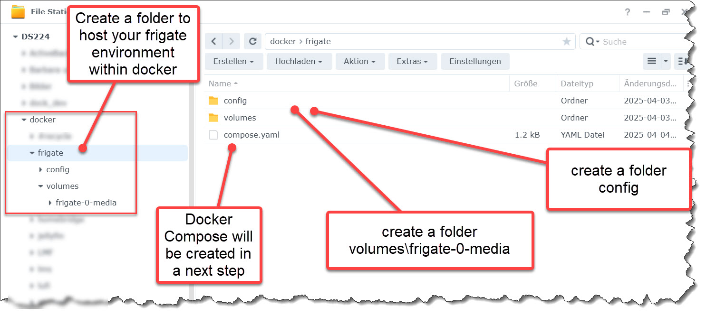
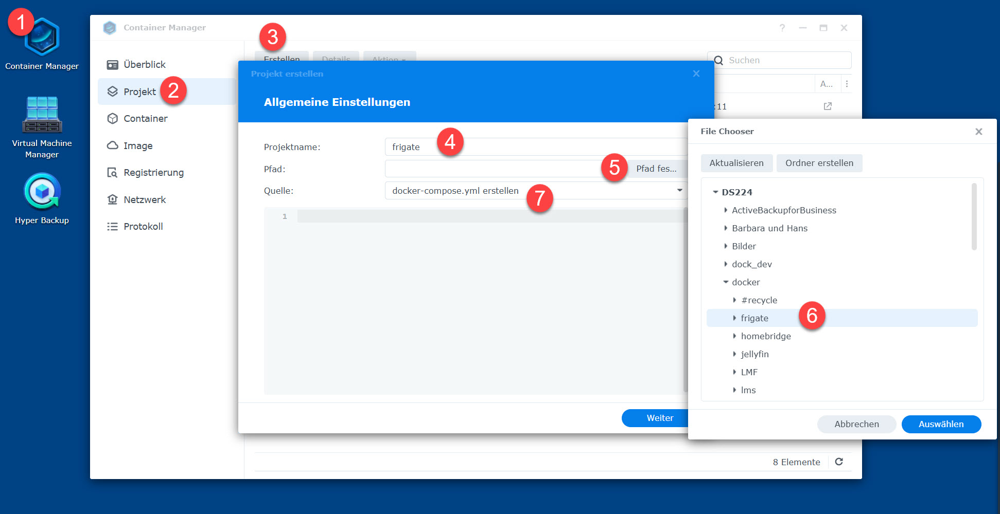
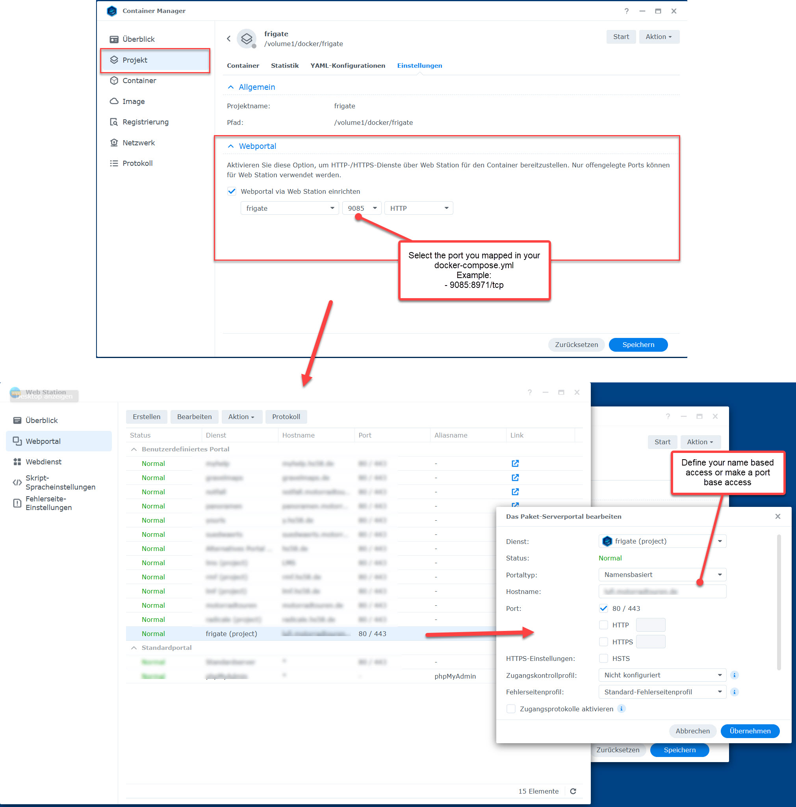

# Frigate in Synology Docker with DSM 7.2.2

<p>How to run a frigate docker on a Synology with DSM 7.2? </p>
<p>The frigate documentation is somehow outdated. So here it is what you need to do.</p>

<h2>Setting up your Synology environment</h2>
<p>

</p>
<ul> 
<li>Within <strong>docker</strong> create a folder for your frigate environment. I myself called it <strong>frigate</strong> </li>
<li>Set up the path for your video clips: <strong>\docker\frigate\volumes\frigate-0-media</strong> .</li>
<li>Set up the path for your config file: <strong>\docker\frigate\config</strong> .</li>
</ul> 

<h2>Create the basic config.yml file</h2>
<p>In folder config create a new yaml file: 

**config.yml** 

with following content:
```
auth:
  reset_admin_password: false

mqtt:
  enabled: false

tls:
  enabled: false # Necessary to avoid routing http to https!

```

<div style="page-break-after: always;"></div>
<h2>Create the docker project</h2>
<p>

</p>

<ol>
<li>run Container Manager </li>
<li>Select Project </li>
<li>Create </li>
<li>provide a project name </li>
<li>select path </li>
<li>choose docker\frigate  </li>
<li>create a new docker-compose.yml </li>
</ol>

```
version: "3.9"
services:
  frigate:
    container_name: frigate
    privileged: true            # this may not be necessary for all setups
    restart: unless-stopped
    stop_grace_period: 30s      # allow enough time to shut down the various services
    image: ghcr.io/blakeblackshear/frigate:stable
    shm_size: "512mb"           # update for your cameras based on calculation above
    volumes:
      - /volume1/docker/frigate/config/config.yml:/config/config.yml
      - /volume1/docker/frigate/volumes/frigate-0-media:/media/frigate
    ports:
      - 1935:1935/tcp         # WebRTC over tcp
      # - "5000:5000/tcp"     # Internal unauthenticated access. Expose carefully. Is used by Synology!
      - 8554:8554/tcp         # RTSP feeds
      - 8555:8555/tcp         # WebRTC over tcp
      - 8555:8555/udp         # WebRTC over udp
      - 9085:8971/tcp         # WebAccess
    environment:
      FRIGATE_RTSP_PASSWORD: "your password"
```

<div style="page-break-after: always;"></div>
<h3>Don't miss to setup your Web Based Access.</h3>
<p>

</p>

<p><strong>Now start your container for the first time.</strong></p>

<div style="page-break-after: always;"></div>
<h2>Check your Password</h2>
<p>Check your container logs. Frigate should have set up the password for the admin user. If you can't find it (as I couldn't) stop the container and change the line in config.yml:</p>

```
reset_admin_password: true

```

<p>Restart your container and check the logs again. Note down your password. <br/>
Don't forget to take back the reset_admin_password to false.</p>

<p>The full documentation to reset the password can be found here: https://docs.frigate.video/configuration/authentication/#resetting-admin-password</p>


<div style="page-break-after: always;"></div>

<h2>Further Steps</h2>
<p>You are now running a basic Frigate. You can login http:\\your_external_address or http://your_internal_ip:9085 (example: http://192.168.68.70:9085)</p>

<p>For how to configure your system further, follow the frigate documentation: https://docs.frigate.video/guides/getting_started
